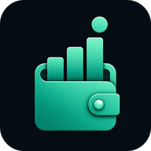
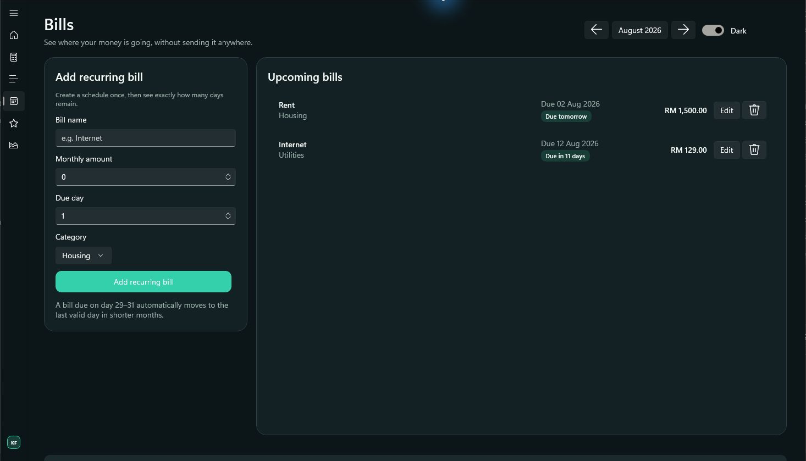

# MyBudget — showcase archive

  

This standalone showcase has been consolidated into the main MyBudget repository so the source, documentation, releases, and project history now live together in one place.

## Continue to MyBudget

**[View the complete project and download releases →](https://github.com/KhaiFaw/mybudget-windows)**

The canonical repository contains the Windows application source, feature documentation, build instructions, release downloads, and ongoing development updates.

## Preview

| Light overview | Dark bills |
|:---:|:---:|
|  |  |

MyBudget is a modern, local-first Windows desktop budget planner built with C#, .NET, WinUI 3, XAML, MVVM, and SQLite. It supports monthly planning, recurring income and bills, daily transactions, carry-forward balances, savings goals, investments, reports, and light/dark themes.

## Repository status

This repository remains online as a lightweight archive for existing links. New releases, issues, documentation, and development activity belong in **[KhaiFaw/mybudget-windows](https://github.com/KhaiFaw/mybudget-windows)**.

## Copyright

Copyright (c) 2026 KhaiFaw. All rights reserved. See [COPYRIGHT.md](COPYRIGHT.md).
