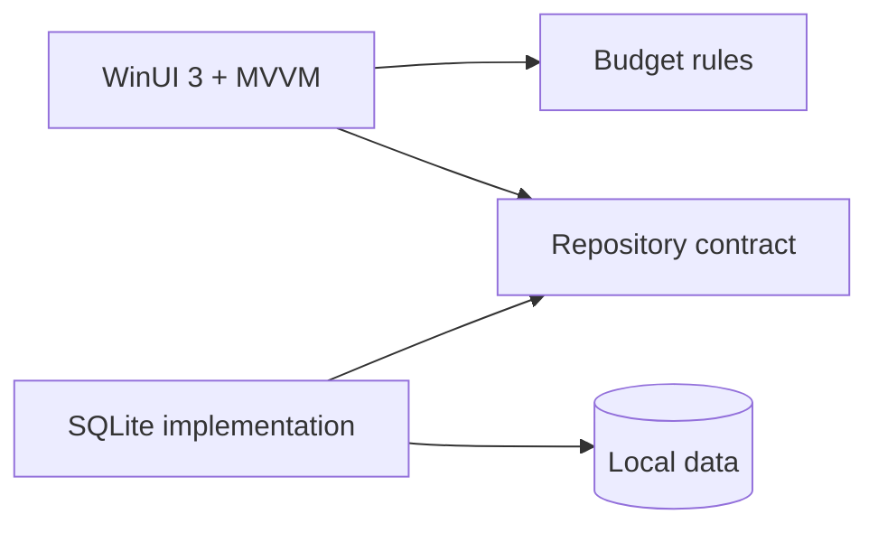

# MyBudget — Windows monthly budget planner

  

MyBudget is a modern, local-first Windows desktop application for planning a month, recording real spending, keeping savings separate, and seeing what is still available at a glance.

This is the public portfolio showcase. The proprietary application source is intentionally kept in a private repository.

## Native app preview

| Light mode | Dark mode |
|---|---|
|  |  |

These are captures from the running native WinUI application. They use the built-in synthetic Malaysian-ringgit budget and contain no personal financial information.

## What the app handles

- income, expenses, savings, refunds, and transfers
- PC-local day tracking, today-first entry, and editable dates for backdating
- editable monthly income directly on the dashboard
- category-level monthly plans and over-budget warnings
- editable recurring bills, nearest-due countdowns, and safe handling for the 29th–31st
- savings goals and progress
- reports by category and month
- a remembered light or dark theme
- selectable display currencies: MYR, USD, SGD, EUR, GBP, and AUD
- responsive navigation across compact and expanded window layouts
- a custom multi-resolution EXE, title-bar, and taskbar icon
- a subtle KF creator mark and KhaiFaw authorship metadata
- local SQLite persistence, database backup, and CSV portability
- synthetic demo data for safe screenshots and walkthroughs

## Product tour

| Area | What it demonstrates |
|---|---|
| Overview | Income, planned money, spending, savings, and available money shown as separate totals |
| Plan | Category-level monthly allocations and clear over-budget feedback |
| Transactions | PC-local daily entry, backdating, and distinct income, expense, savings, refund, and transfer types |
| Bills | Editable recurring commitments, next-due countdowns, and month-end date handling |
| Goals | Savings targets and progress at a glance |
| Reports | Category and month summaries for understanding spending patterns |
| Settings | Theme and display-currency preferences, local backup, CSV portability, and a synthetic example-budget loader |

## Engineering highlights

- C# 14, .NET 10 LTS, WinUI 3, XAML, and MVVM
- clean separation between UI, business rules, and SQLite persistence
- exact decimal money calculations
- parameterized SQL and explicit schema initialization
- automated tests for calculations, date boundaries, database round trips, and settings
- GitHub Actions validation on Windows
- no account, ads, analytics, telemetry, or cloud sync

## Why the source is private

The project is currently proprietary while it is being developed and used as a portfolio piece. This repository deliberately contains no application source, reusable code, installer or executable build, database, CSV export, backup, signing material, or build output.

Prospective employers and serious reviewers can request a guided code walkthrough or time-limited private review through my GitHub profile. Access is granted case by case and does not grant permission to copy, redistribute, or reuse the source.

## Verification

- 61 automated tests passed: 42 budget/calendar tests and 19 SQLite/schema/CSV tests
- Release x64 build completed with zero warnings and zero errors
- NuGet audit found no known vulnerable packages
- all seven screens rendered in the real Windows app
- local-date entry, one-click income editing, bill editing/countdowns, app icon, and persistent dark mode were exercised in the real Windows app

The first release is focused on dependable monthly calculations, accessible light/dark modes, recoverable local storage, and a pleasant native Windows experience. A short demo can be added as the next portfolio artifact.

## Copyright

Copyright (c) 2026 KhaiFaw. All rights reserved. See [COPYRIGHT.md](COPYRIGHT.md). No open-source license is granted.
