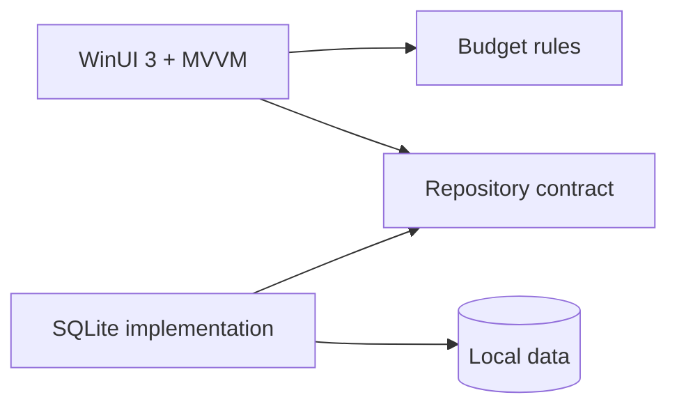

# MyBudget — Windows monthly budget planner

MyBudget is a modern, local-first Windows desktop application for planning a month, recording real spending, keeping savings separate, and seeing what is still available at a glance.

This is the public portfolio showcase. The proprietary application source is intentionally kept in a private repository.

## Design preview

| Light mode | Dark mode |
|---|---|
|  |  |

These high-fidelity images are the approved design targets. They use synthetic Malaysian-ringgit data and contain no personal financial information. The native WinUI implementation has also been visually smoke-tested in both themes.

## What the app handles

- income, expenses, savings, refunds, and transfers
- category-level monthly plans and over-budget warnings
- recurring bills, including safe handling for due dates on the 29th–31st
- savings goals and progress
- reports by category and month
- a remembered light or dark theme
- local SQLite persistence, database backup, and CSV portability
- synthetic demo data for safe screenshots and walkthroughs

## Engineering highlights

- C# 14, .NET 10 LTS, WinUI 3, XAML, and MVVM
- clean separation between UI, business rules, and SQLite persistence
- exact decimal money calculations
- parameterized SQL and explicit schema initialization
- automated tests for calculations, date boundaries, database round trips, and settings
- GitHub Actions validation on Windows
- no account, ads, analytics, telemetry, or cloud sync

## Why the source is private

The project is currently proprietary while it is being developed and used as a portfolio piece. This repository deliberately contains no application source, reusable code, installer, database, or signing material.

Prospective employers and serious reviewers can request a guided code walkthrough or time-limited private review through my GitHub profile. Access is granted case by case and does not grant permission to copy, redistribute, or reuse the source.

## Verification

- 45 automated tests passed: 27 budget/calendar tests and 18 SQLite/schema/CSV tests
- Release x64 build completed with zero warnings and zero errors
- NuGet audit found no known vulnerable packages
- all seven screens rendered in the real Windows app
- dark mode visibly applied and persisted locally

The first release is focused on dependable monthly calculations, accessible light/dark modes, recoverable local storage, and a pleasant native Windows experience. A short demo can be added as the next portfolio artifact.

## Copyright

Copyright (c) 2026 KhaiFaw. All rights reserved. See [COPYRIGHT.md](COPYRIGHT.md). No open-source license is granted.
